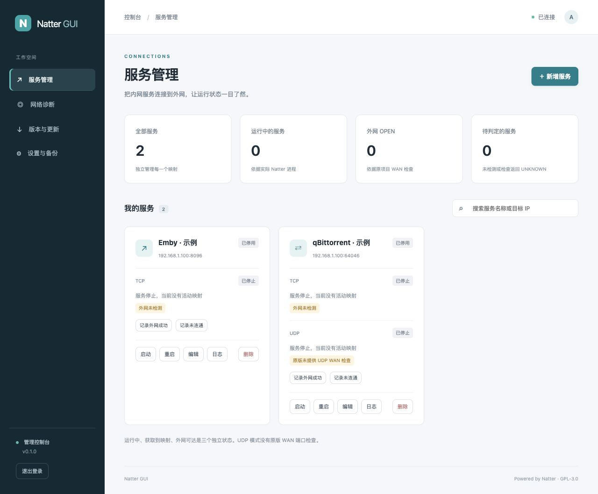

# Natter GUI

一个适用于 Linux、香橙派和 NAS 的 Natter Web 管理面板。通过浏览器新增、编辑、删除 TCP / UDP 端口映射，查看原版检测结果和日志。

面板管理独立的 Natter 实例，核心源码从 [MikeWang000000/Natter](https://github.com/MikeWang000000/Natter) 的正式 Release 同步。原始核心文件保持不变，固定版本和校验值记录在 [upstream.lock.json](upstream.lock.json)。

## 当前功能

- 服务新增、编辑、删除，启动、停止、重启；Emby、Plex、qBittorrent 模板。
- 一个服务支持 TCP、UDP 或两者，两种协议独立运行和显示状态。
- 公网地址与端口、实际进程状态、原版 LAN / WAN 检查和日志。
- 原版 NatterCheck 异步检测；人工外网验证记录与映射变化后失效标记。
- 服务配置导入、导出；导入默认停用，不包含管理员认证数据。
- 管理员登录、密码修改、会话过期、CSRF 防护和登录失败节流。
- Linux 原生安装、systemd 启动；可选的专用账户主路由策略路由。
- Linux ARM64 / AMD64 Docker 构建，GitHub 自动同步上游 Release。

完整的 [架构与实施计划](docs/ARCHITECTURE.md)、[状态判定标准](docs/STATUS.md)、[部署与迁移说明](docs/DEPLOYMENT.md)、[更新机制](docs/UPDATES.md)。



## 使用 AI Agent 安装

把下面这段自然语言指令复制给能够执行终端命令、连接 SSH 的 AI Agent，并填写设备与服务信息。完整的可复制安装指令、参数示例和验收要求见 [Agent 安装指南](docs/AGENT-INSTALL.md)。

```text
请帮我实际安装并配置 Natter GUI：https://github.com/sexyfeifan/Natter-GUI。
请先读取该仓库的 README.md 和 docs/AGENT-INSTALL.md，按其中的完整安装流程执行；不要只给我安装命令。
目标设备：[本机 / 远程设备 / 请先询问我]。
如果未说明安装位置，先确认是安装在 Agent 当前运行的本机，还是另一台设备。
如果安装在远程设备，请在需要时提示我补充设备 IP 或主机名、SSH 端口（未指定时默认22）、SSH 账号、密码或可用密钥；已有信息不要重复询问，密钥可用时不必索要密码。
连接信息不齐或认证未成功时，先等待我补充，不要改成在本机安装。密码仅用于连接指定设备，不打印到日志或写入源码。
需要映射的服务：[名称、目标局域网 IPv4、目标端口、TCP/UDP/两者、需要保留的绑定端口]。
网络情况：[默认网关、是否有旁路由、主路由地址；不知道的请先检测]。
安装方式：自动选择适合设备的原生 systemd 或 Docker 方式。
请备份并保留已有配置、密码和服务；如果发现旧 Natter 实例，先准备回退再迁移，避免端口冲突。
新安装默认密码使用 admin，不增加密码长度或复杂度要求，不强制首次修改。
完成后验证登录、服务状态、映射、转发和开机启动，告诉我面板地址、版本、备份位置与准确的回退方法。
外网连通和播放/下载提速分别验证；无法从真正外网测试时，请明确标记待验证，不宣称已生效或提速。
```

设备密码、私钥和应用令牌只在你与 Agent 的私有会话中提供，不填进 GitHub 文档或提交记录。升级已有安装时默认保留当前管理员密码；需要重置为 `admin` 时，在指令中明确写出。

## 本地运行

需要 Python 3.11 或更新版本，没有 pip / npm 依赖。

```bash
git clone https://github.com/sexyfeifan/Natter-GUI.git
cd Natter-GUI
python3 -m natter_gui --host 127.0.0.1 --port 9080 --state-dir .state
```

默认管理员密码为 `admin`。没有密码长度或复杂度限制，也不强制首次修改密码。新安装可直接使用默认密码登录；已有配置升级时保留当前密码。

首次密码也记录在运行目录：

```bash
cat .state/bootstrap-password.txt
```

访问 `http://127.0.0.1:9080`。改密码后首次密码文件会删除。停止面板会停止它管理的子进程；已启用服务将在下次启动时恢复。

## 香橙派 / Linux 原生安装

```bash
sudo ./scripts/install.sh
```

面板地址为 `http://设备IP:9080`，新安装默认密码为 `admin`，首次密码文件为 `/var/lib/natter-gui/bootstrap-password.txt`。

如果设备默认走旁路由，希望面板及其 Natter 进程单独走主路由，可以指定实际网关和网卡：

```bash
sudo ./scripts/install.sh --gateway 192.168.1.1 --interface end0
```

此配置只匹配专用 `natter-gui` 账户，不修改系统默认网关。网关必须属于该网卡的 IPv4 子网。路由配置由 root 的 systemd 单元管理，浏览器 API 不接受任意路由或 shell 命令。

已有手工部署的 Natter 服务需要先进行迁移，避免两个进程争用同一个绑定端口。具体步骤见 [迁移说明](docs/DEPLOYMENT.md#从已有-natter-部署迁移)。

## Docker

使用 Linux 主机的 host 网络；NAS 可使用支持该网络模式的容器管理器。

```bash
docker compose up -d --build
docker compose exec natter-gui cat /data/bootstrap-password.txt
```

镜像 CI 发布地址为 `ghcr.io/sexyfeifan/natter-gui:latest`。也可以拉取已发布镜像运行：

```bash
docker compose pull
docker compose up -d --no-build
```

Docker 使用主机既有出口。原生安装脚本的专用账户策略路由不会自动应用到 Docker 容器。管理面板供受控网络使用，跨互联网管理时通过 HTTPS 反向代理或 VPN 访问；服务端支持 `--secure-cookie`。

## 状态和测试

**运行中 ≠ 获得公网映射 ≠ 外网可达。** 面板保留原版的 `OPEN / CLOSED / UNKNOWN`。`UNKNOWN` 表示无法判定，不自动转换为失败或成功；UDP 模式没有原版 WAN 端口检查。

外网实测时，用手机关闭 Wi-Fi 后访问当前映射地址。人工验证与原版检查分别展示。源端口或公网 IP 变化后，旧人工验证记录会标为历史。

连通性改善不等于突破运营商带宽。Emby / Plex 用同一视频和画质比较缓冲表现；BT 对比同一批任务的入站连接和稳定下载速率。面板首版没有内置带宽测速服务。

## 自动同步和构建

每天 03:17 UTC（北京时间 11:17），GitHub 工作流查询上游最新正式 Release，按不可变提交下载核心，校验 CLI 和版本、运行测试，再提交固定源码并构建多架构镜像。工作流只更新 `vendor/natter` 和 `upstream.lock.json`。

若仓库分支保护禁止机器人直接提交，工作流会失败并保留当前版本。GitHub 公共仓库长时间没有活动时可能停用定时工作流；可在 Actions 中重新启用或手动运行。参见 [GitHub schedule 文档](https://docs.github.com/en/actions/reference/workflows-and-actions/events-that-trigger-workflows#schedule)。

设备端的“检查上游版本”只查询版本，首版不在线替换运行中的核心。原生升级重新执行安装脚本，Docker 升级拉取新镜像；状态目录保持独立。

## 开发验证

```bash
python3 scripts/sync_upstream.py --verify
python3 -m unittest discover -v
node --check natter_gui/web/app.js
sh -n scripts/install.sh
```

测试覆盖真实子进程生命周期、双协议服务、原版 WAN 返回结果、状态更新、人工验证失效、导入原子性、登录、CSRF 和密码修改。核心网络环境需要在实际设备上另行验证。

## 许可

GPL-3.0。原项目归属、版权与许可保留在 [NOTICE](NOTICE) 和核心文件中。
