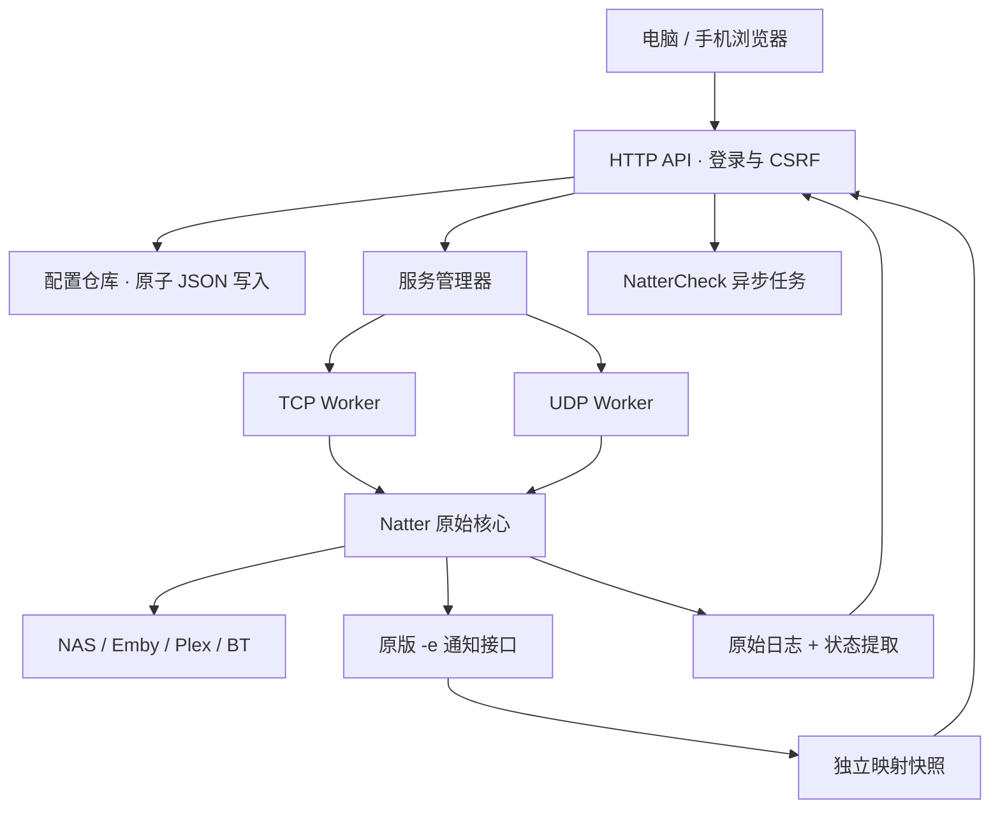

# 架构与实施计划

## 产品边界

Natter GUI 面向家庭网络和 NAS 用户，把一个端口映射作为一个“服务”管理。新增或删除的是映射配置与 Natter 实例；不安装或卸载目标 NAS 软件。

首版采用 Python 标准库后台 + 同源 Web 页面，Linux ARM64 / AMD64 为主要部署平台。浏览器提供跨设备 GUI，不需要在香橙派运行桌面环境。面板、Natter 核心、设备配置分别管理。

## 系统结构



### 模块职责

| 模块 | 责任 |
|---|---|
| `core.py` | 服务校验、固定参数生成、原始检查结果提取 |
| `store.py` | 配置、密码哈希、原子写入 |
| `supervisor.py` | 服务 CRUD、进程生命周期、双协议拆分、NAT 检测任务 |
| `notify.py` | 接收原版通知，写入当前映射快照 |
| `server.py` | API、会话、CSRF、同源静态界面、上游版本查询 |
| `web/` | 服务卡片、配置表单、日志、诊断、版本、备份 |
| `vendor/natter/` | 不修改的上游核心和许可证 |
| `upstream.lock.json` | Release、提交 SHA、各文件校验值 |
| `scripts/route_helper.py` | 可选的 root UID 路由单元，独立于 Web API |
| `.github/workflows/` | 验证、自动同步、多架构镜像与发布包 |

## 服务模型

一个服务包含 ID、名称、目标 IPv4 / 端口、绑定 IPv4 / 端口、TCP / UDP / 双协议、UPnP、保活间隔、等待目标服务选项、启用状态。

- ID 由后台生成，不参与用户输入的文件路径。
- 双协议拆为两个 Worker，各自具有进程、映射、日志和检查状态。
- 启用状态持久化，面板重启后恢复已启用服务。
- 编辑先验证集合及端口冲突，再停止旧进程、保存配置、启动新进程。
- 停止旧进程后持久化停用状态，不会随面板重启恢复。
- 删除等待进程终止，再清理配置和 Worker 文件。上游 UPnP 租约自然到期回收，默认通常不超过 45 秒。
- 原版内部处理映射变化和保活；核心进程退出后，管理器以 15 秒间隔重启已启用 Worker。
- 自动分配的绑定端口与最终公网端口不是固定值，界面使用通知里的实际地址。
- BT 双协议公网端口不保证在所有 NAT 环境中一致，面板分别显示；涉及 Tracker 的宣告配置需独立处理。

首版提供 socket 转发，不把浏览器输入传给 shell，也不接受自定义命令、通知脚本、核心路径或任意 systemd 单元名。高效率内核转发留到权限代理完成之后。

## 数据和权限

状态目录为 `.state`、Docker `/data` 或原生 `/var/lib/natter-gui`，与代码版本分离。

```text
config.json                 管理员哈希与服务配置，0600
bootstrap-password.txt      首次默认密码 admin，0600，修改密码后删除
<service>-verification.json 人工验证记录及对应映射
workers/<id>-<protocol>/
  mapping.json              原版通知生成的快照
  core.log                  原始日志，轮转保留三个 1 MiB 文件
```

管理 API 要求登录，写操作要求 CSRF token；Cookie 为 HttpOnly + SameSite=Strict，支持 HTTPS Secure。密码使用 PBKDF2-SHA256，随机盐和 600000 次迭代。配置导出不包含认证信息。

新安装默认密码为 `admin`，不限制密码长度或复杂度，不强制首次修改。升级保留已有密码，密码重置不修改服务配置。

原生面板以 `natter-gui` 非登录账户运行。UID 路由选项由 root 安装时配置，只影响该账户的流量。Docker 默认非 root 用户和 host 网络，不包含通用 root 管理接口。

## 判定标准

所有原版检测值按原意保留。进程状态、公网映射、LAN 检查、WAN 检查、人工验证分别呈现。详见 [状态标准](STATUS.md)。速度不用于判断打洞是否成功。

## 上游与发布

采用固定提交的 vendored core，而不是运行时下载 master。更新机器人只更改上游目录和锁文件，避免与 GUI 开发产生合并冲突。CLI 合约与状态适配测试通过后提交、构建镜像。GUI 与 core 有独立版本，设备配置不参与同步。

## 分阶段计划与验收

| 阶段 | 内容 | 验收标准 |
|---|---|---|
| v0.1 当前 | CRUD、登录、日志、原版状态、NAT 检测、人工验证、JSON 备份、原生 / Docker、源码同步 CI | API 与进程测试通过；用户可以实际新增和删除映射；上游核心校验一致 |
| v0.1 设备验收 | 香橙派安装、跨 VLAN 转发、主 / 旁路由、Emby / Plex / BT | 移动网络验证每个入口；重启恢复；删除后租约回收；原服务配置可迁回 |
| v0.2 更新与地址 | 发布包升级 / 回退、DDNS、映射变更通知、现有 systemd 导入预览 | IP 变化后客户端地址及时更新；升级失败可恢复旧版本和原配置 |
| v0.3 性能诊断 | 有限时长的外网测速、测速记录、流量指标、内核转发权限代理 | 指标来自真实数据；严格区分直连、转码、网络限速和单连接瓶颈 |
| v0.4 应用集成 | qBittorrent Tracker 宣告、Plex / Emby 地址集成、NAS 适配 | 使用明确授权的应用凭据；BT 外部端口变化后正确宣告；凭据不进入导出或日志 |

后续阶段是计划，不在首版界面中显示虚假的成功状态。首版不提供桌面客户端、在线核心替换、DDNS、应用凭据集成或带宽测速。

## 验证层次

1. 单元与集成：参数校验、状态提取、官方 PortTest 返回矩阵、真实子进程、HTTP 认证和 CRUD。
2. 构建：Python 3.11 / 3.13、JavaScript 语法、源码校验、Linux ARM64 / AMD64 镜像。
3. 设备：实际 NAT / UPnP / 网关、跨子网目标服务、重启、停止和迁移。
4. 外网：移动网络或独立远端验证 TCP 与 UDP。登录页可达不作为提速证据。

不同转发方式会影响来源 IP。首版 socket 转发会让目标看到转发设备 IP，部署时需确认应用的内网免认证和内网限速规则与预期一致。
